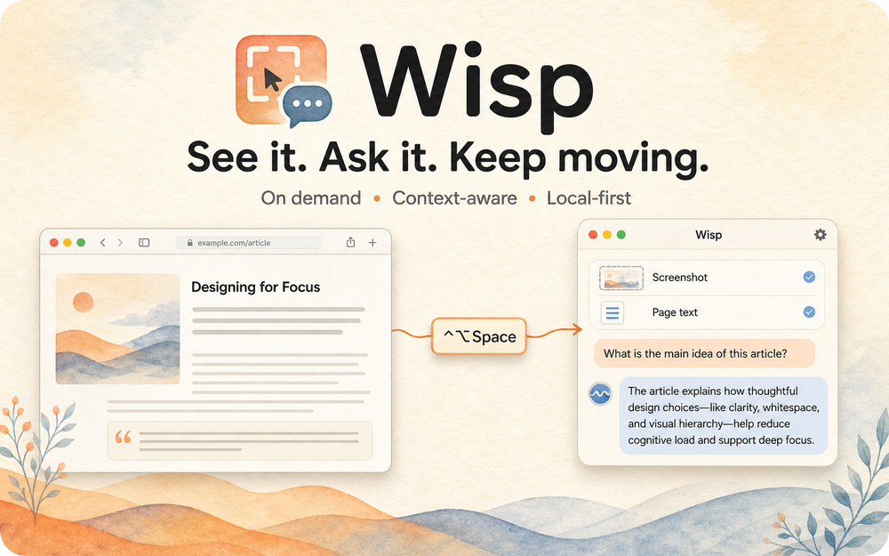
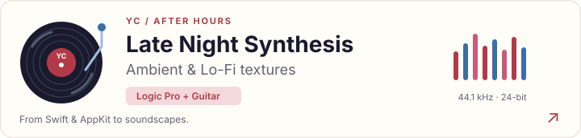

 

  

  &nbsp;
  &nbsp;
  &nbsp;
  

---

## Featured Work

<table>
<tr>
<td width="50%" valign="top">
  
  <h3>Orbit</h3>
  
A native macOS radial app switcher. Hold a key, flick toward an app, release.

  

    <code>Swift</code> <code>AppKit</code> <code>macOS</code> 
    <a href="https://github.com/ycl-2004/Orbit"><b>GitHub ↗</b></a> &nbsp;·&nbsp; <a href="https://github.com/ycl-2004/Orbit/releases/latest"><b>Download ↗</b></a>
  

</td>
<td width="50%" valign="top">
  
  <h3>NoType</h3>
  
Private, local dictation for macOS that handles mixed Chinese and English speech.

  

    <code>Swift</code> <code>WhisperKit</code> <code>Core ML</code> 
    <a href="https://github.com/ycl-2004/NoType"><b>GitHub ↗</b></a> &nbsp;·&nbsp; <a href="https://github.com/ycl-2004/NoType/releases/latest"><b>Download ↗</b></a>
  

</td>
</tr>
<tr>
<td width="50%" valign="top">
  
  <h3>Wisp</h3>
  
A native macOS AI assistant that reads your current screen and browser context when you ask.

  

    <code>Swift</code> <code>SwiftUI</code> <code>macOS</code> 
    <a href="https://github.com/ycl-2004/Wisp"><b>GitHub ↗</b></a> &nbsp;·&nbsp; <a href="https://github.com/ycl-2004/Wisp/releases/latest"><b>Download ↗</b></a>
  

</td>
<td width="50%" valign="top">
  
  <h3>FoldPeek</h3>
  
Browse folders and preview files directly inside Finder Quick Look, without opening another window.

  

    <code>Swift</code> <code>AppKit</code> <code>Quick Look</code> 
    <a href="https://github.com/ycl-2004/FoldPeek"><b>GitHub ↗</b></a> &nbsp;·&nbsp; <a href="https://github.com/ycl-2004/FoldPeek/releases/latest"><b>Download ↗</b></a>
  

</td>
</tr>
</table>

---

## AI Focus &amp; Engineering Principles

  

 

<table>
<tr>
<td width="50%" valign="top">
<h4>🧠 Current AI Focus &amp; R&amp;D</h4>
<ul>
  <li><b>Agent Memory &amp; Handoff</b>: Designing cross-agent context persistence and stateful memory buses (<a href="https://github.com/ycl-2004/ShareMemory">ShareMemory</a>).</li>
  <li><b>On-Device Neural Inference</b>: Optimizing WhisperKit, Core ML, and local models for Apple Silicon with zero cloud latency (<a href="https://github.com/ycl-2004/NoType">NoType</a>).</li>
  <li><b>Context-Aware Ambient AI</b>: Building native assistants that observe active visual and browser environments (<a href="https://github.com/ycl-2004/Wisp">Wisp</a>).</li>
  <li><b>Hardware-Aware Machine Learning</b>: Bridging my Electrical Engineering foundation (bandwidth, latency, compute budgets) with edge AI execution.</li>
</ul>
</td>
<td width="50%" valign="top">
<h4>⚡ AI Engineering Principles</h4>
<ul>
  <li><b>Local-First &amp; Private</b>: Intelligence belongs near the user. On-device compute guarantees zero telemetry and zero network latency.</li>
  <li><b>Ambient Context &gt; Prompts</b>: The best AI tools don't force users to craft prompts; they observe active context and act with tactile precision.</li>
  <li><b>Autonomous Multi-Agent Loops</b>: Shifting from single-turn chat boxes to persistent, collaborative agent handoffs and tool execution.</li>
  <li><b>Systems Grounding (EE ➔ AI)</b>: Approaching models as physical, compute-constrained systems rather than black-box APIs.</li>
</ul>
</td>
</tr>
</table>

---

## More things I've made

<table>
<tr>
<td width="33%" valign="top">
  <a href="https://github.com/ycl-2004/AI-Agent-Projects"><b>AI Agent Projects</b></a> 
  Agent experiments, autonomous prototypes, and context workflows
</td>
<td width="33%" valign="top">
  <a href="https://github.com/ycl-2004/Browser_Organizer"><b>Browser Organizer</b></a> 
  A calm Chrome new-tab dashboard for active tabs and project sessions
</td>
<td width="33%" valign="top">
  <a href="https://github.com/ycl-2004/YC_Todo"><b>YC Todo</b></a> 
  Lightweight menu-bar tasks and timer focus, zero account required
</td>
</tr>
<tr>
<td valign="top">
  <a href="https://github.com/ycl-2004/ShareMemory"><b>ShareMemory</b></a> 
  Shared project memory engine for Claude Code and Codex
</td>
<td valign="top">
  <a href="https://github.com/ycl-2004/Screen-Bridge"><b>Screen Bridge</b></a> 
  Turns an iPad into a wireless, low-latency second display for Mac
</td>
<td valign="top">
  <a href="https://github.com/ycl-2004?tab=repositories"><b>All Repositories →</b></a> 
  Everything else I build and share in the open
</td>
</tr>
</table>

---

## Beyond code

  When I'm not training local models or profiling macOS runtimes, I produce soundscapes, design visual narratives, and explore the intersection of human emotion and generative creativity.

  <a href="https://ycl-2004.github.io/Profile/"><b>✦ YC Portfolio ↗</b></a> &nbsp;·&nbsp;
  <a href="https://github.com/ycl-2004/YC_IP"><b>🎨 YC_IP Universe ↗</b></a> &nbsp;·&nbsp;
  <a href="https://www.instagram.com/linyc_04/"><b>📷 Instagram ↗</b></a>

 

  

