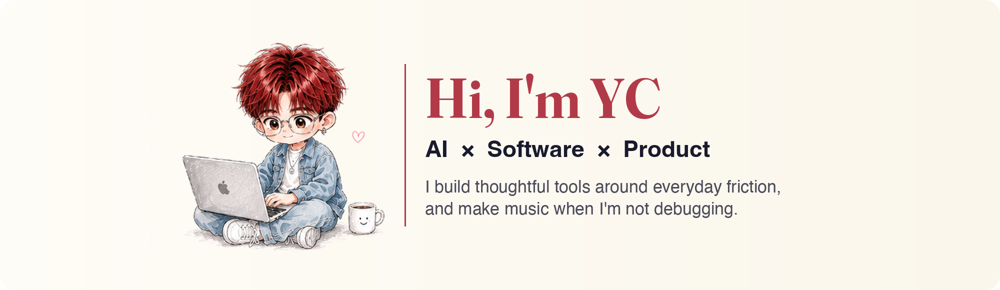
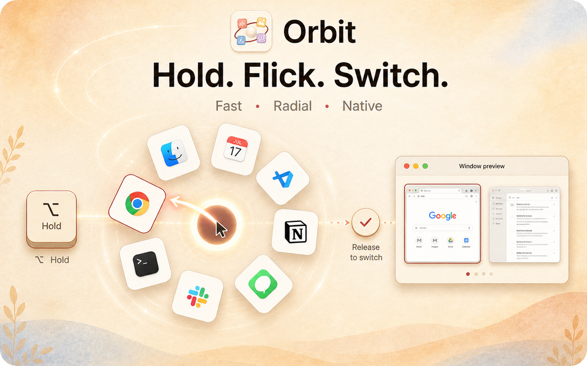
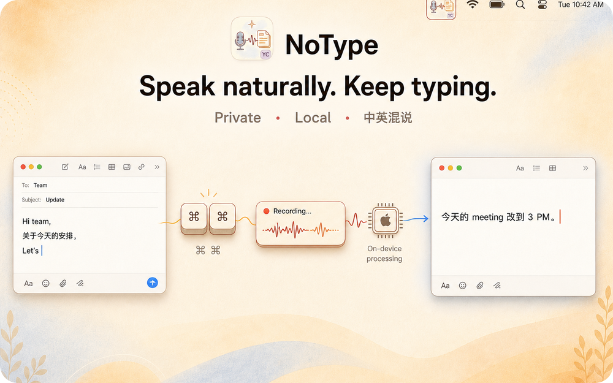
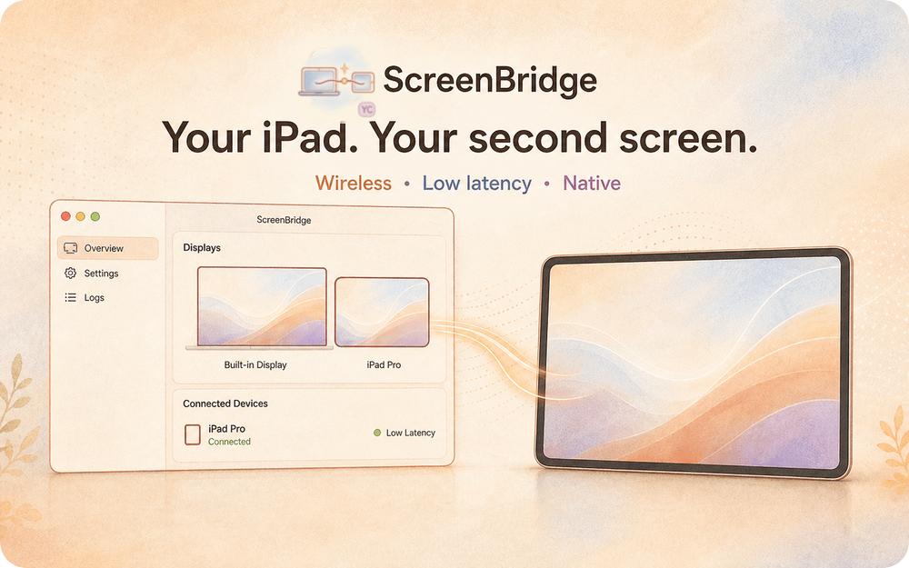
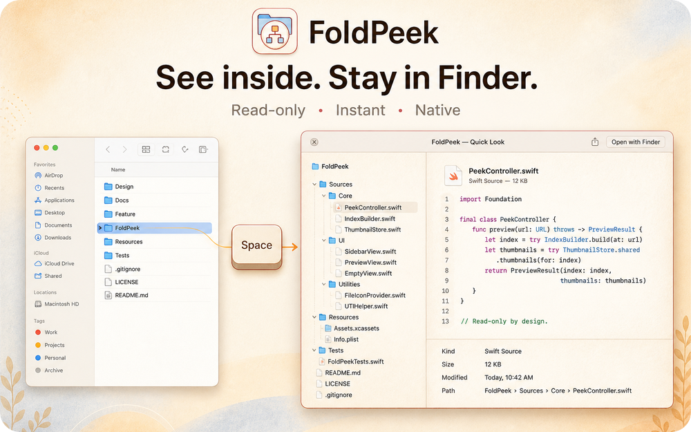

Electrical Engineering at UBC, living between Vancouver and Taiwan.

  
  
  
  

---

## Featured Work

<table>
<tr>
<td width="50%" valign="top">
  
  <h3>Orbit</h3>
  
A native macOS radial app switcher. Hold a key, flick toward an app, release.

  

    <code>Swift</code> <code>AppKit</code> <code>macOS</code> 
    <a href="https://github.com/ycl-2004/Orbit"><b>GitHub ↗</b></a> &nbsp;·&nbsp; <a href="https://github.com/ycl-2004/Orbit/releases/latest"><b>Download ↗</b></a>
  

</td>
<td width="50%" valign="top">
  
  <h3>NoType</h3>
  
Private, local dictation for macOS that handles mixed Chinese and English speech.

  

    <code>Swift</code> <code>WhisperKit</code> <code>Core ML</code> 
    <a href="https://github.com/ycl-2004/NoType"><b>GitHub ↗</b></a> &nbsp;·&nbsp; <a href="https://github.com/ycl-2004/NoType/releases/latest"><b>Download ↗</b></a>
  

</td>
</tr>
<tr>
<td width="50%" valign="top">
  
  <h3>Screen Bridge</h3>
  
Turns an iPad into a wireless second display for the Mac, with control staying on the Mac.

  

    <code>Swift</code> <code>macOS</code> <code>iPadOS</code> 
    <a href="https://github.com/ycl-2004/Screen-Bridge"><b>GitHub ↗</b></a> &nbsp;·&nbsp; <a href="https://github.com/ycl-2004/Screen-Bridge/releases/latest"><b>Download ↗</b></a>
  

</td>
<td width="50%" valign="top">
  
  <h3>FoldPeek</h3>
  
Browse folders and preview files directly inside Finder Quick Look, without opening another window.

  

    <code>Swift</code> <code>AppKit</code> <code>Quick Look</code> 
    <a href="https://github.com/ycl-2004/FoldPeek"><b>GitHub ↗</b></a> &nbsp;·&nbsp; <a href="https://github.com/ycl-2004/FoldPeek/releases/latest"><b>Download ↗</b></a>
  

</td>
</tr>
</table>

---

## Now

- 🧠 Exploring agent memory and cross-agent handoff
- 🧰 Building small macOS tools around everyday friction
- 🎨 Studying human-centered product design
- 🎵 Making music, and writing about what I learn along the way

---

## More things I've made

<table>
<tr>
<td width="33%" valign="top">
  <a href="https://github.com/ycl-2004/AI-Agent-Projects"><b>AI Agent Projects</b></a> 
  Agent experiments, prototypes, and workflows
</td>
<td width="33%" valign="top">
  <a href="https://github.com/ycl-2004/Browser_Organizer"><b>Browser Organizer</b></a> 
  A calm Chrome new tab for tabs and sessions
</td>
<td width="33%" valign="top">
  <a href="https://github.com/ycl-2004/YC_Todo"><b>YC Todo</b></a> 
  Menu-bar tasks and focus, no account needed
</td>
</tr>
<tr>
<td valign="top">
  <a href="https://github.com/ycl-2004/ShareMemory"><b>ShareMemory</b></a> 
  Shared project memory for Claude Code and Codex
</td>
<td valign="top">
  <a href="https://github.com/ycl-2004/yc_Fable5"><b>Fable</b></a> 
  An operating system for structured agent work
</td>
<td valign="top">
  <a href="https://github.com/ycl-2004?tab=repositories"><b>All repositories →</b></a> 
  Everything else I keep in public
</td>
</tr>
</table>

---

## Beyond code

I love **music**, create **visual work**, and **share** what I learn along the way.

  <a href="https://ycl-2004.github.io/YC/"><b>YC ↗</b></a> &nbsp;·&nbsp;
  <a href="https://github.com/ycl-2004/YC_IP"><b>YC_IP ↗</b></a> &nbsp;·&nbsp;
  <a href="https://www.instagram.com/linyc_04/"><b>Instagram ↗</b></a>

