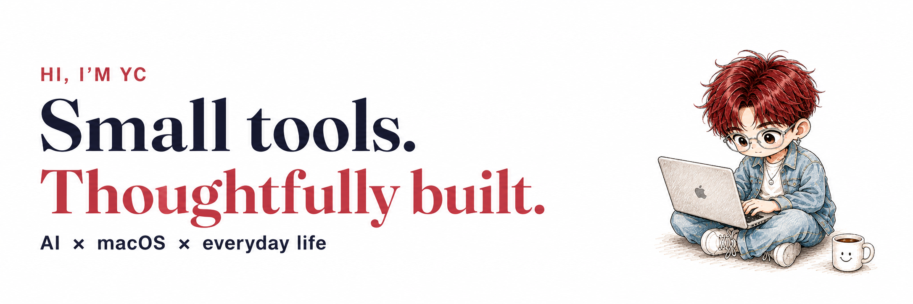
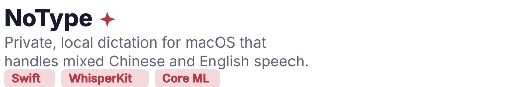
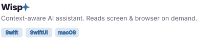
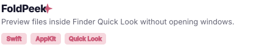
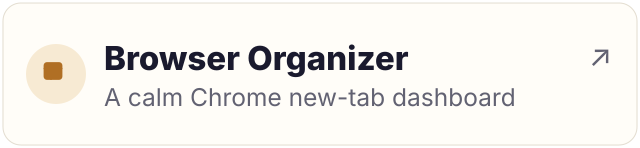
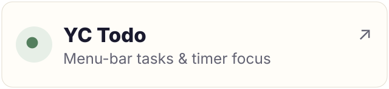
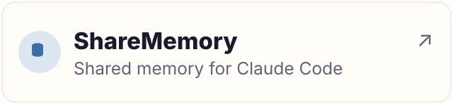
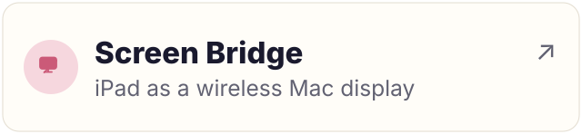
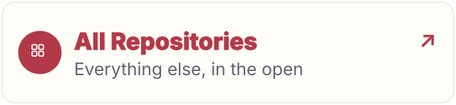

  
  
  

  
  
  
  

## Featured Work

<table>
<tr>
<td width="50%" valign="top">
  
  
  

    
    
  

</td>
<td width="50%" valign="top">
  
  
  

    
    
  

</td>
</tr>
<tr>
<td width="50%" valign="top">
  
  
  

    
    
  

</td>
<td width="50%" valign="top">
  
  
  

    
    
  

</td>
</tr>
</table>

## More things I've made

<table>
<tr>
<td width="33%" valign="top">
  
</td>
<td width="33%" valign="top">
  
</td>
<td width="33%" valign="top">
  
</td>
</tr>
<tr>
<td valign="top">
  
</td>
<td valign="top">
  
</td>
<td valign="top">
  
</td>
</tr>
</table>

## Under the hood

I’m exploring how local models and agent systems can fit into the tools we already use.

- **Agent memory & handoff.** Keeping project context useful across sessions and tools with [ShareMemory](https://github.com/ycl-2004/ShareMemory).
- **On-device inference.** Working with WhisperKit, Core ML, and Apple Silicon in [NoType](https://github.com/ycl-2004/NoType).
- **Context-aware assistance.** Bringing screen and browser context into [Wisp](https://github.com/ycl-2004/Wisp) when the user asks.
- **Hardware-aware engineering.** Thinking through latency, memory, and compute budgets alongside model quality.

- **Keep data close.** Prefer on-device processing where it makes sense, and make network dependencies explicit.
- **Keep the user in control.** Context should be intentional; actions should be understandable.
- **Make handoffs explicit.** Give agents useful state, clear boundaries, and outcomes that can be checked.
- **Sweat the small interactions.** A shortcut, a preview, or one less window can make a tool worth keeping.

## Beyond code

  
  
  

---

  
  

